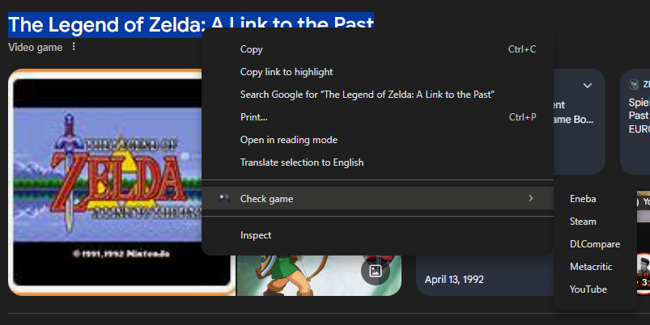
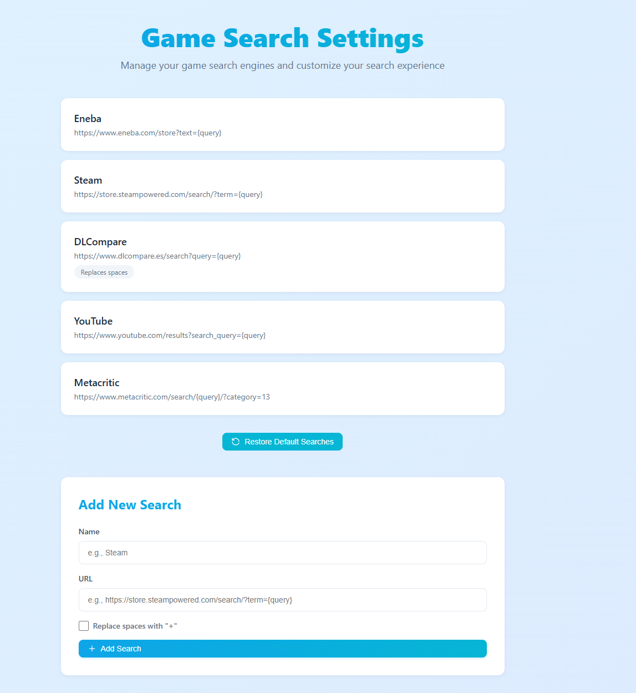

# chrome-search-game

An extension for chrome that searchs the selected text in different gaming websites (and youtube).
This extension was written as a personal thing but in the end I don't mind sharing it.

I will work on publishing to the chrome web store in the next days.

## How to use it

Just use your browser, if you find a game (or anything) you want to query, select it with the mouse, right click and choose the service you want to query.

You can edit or delete the services or add your custom URLs in the configuration. Use "{query}" as the placeholder for the selected text.

## Contribution

You can propose new services to be added but only if the service is highly requested I will add it to the code as you can configure your own! :)
In any case, feel free to PR!